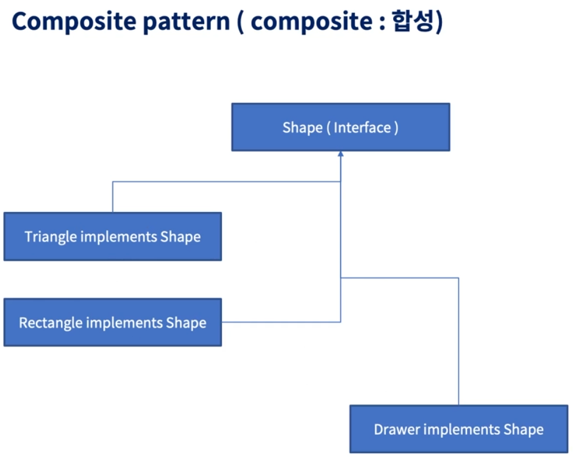

# Effective_Java_Study


## 📖 상속보다는 컴포지션을 사용하라

### 핵심 정리

상속은 강력하지만 캡슐화를 해친다는 문제가 있다.

상속은 상위 클래스와 하위 클래스가 순수한 is-a 관계일 때만 써야 한다.

is-a 관계일 때도 안심할 수만은 없는 게, 하위 클래스의 패키지가 상위 클래스와 다르고, 상위 클래스가 확장을 고려해 설계되지 않았다면 여전히 문제가 될 수 있다.

상속의 취약점을 하여면 상속 대신 컴포지션과 전달을 사용하자. 

특히 래퍼 클래스로 구현할 적당한 인터페이스가 있다면 더욱 그렇다.

래퍼 클래스는 하위 클래스보다 견고하고 강력하다.

## 💡 주요 내용 정리 & 🛠️ 실습 코드


### 매서드 호출과 달리 상속은 캡슐화를 깨뜨린다.

상위 클래스가 어떻게 구현되느냐에 따라 하위 클래스의 동작에 이상이 생길 수 있다.

상위 클래스는 릴리스마다 내부 구현이 달라질 수 있으며, 그 여파로 코드 한 줄 건드리지 않은 하위 클래스가 오동작할 수 있습니다.

이러한 이유로 상위 클래스 설계자가 확장을 충분히 고려하고 문서화도 제대로 해두지 않으면 하위 클래스는 상위 클래스의 변화에 발맞춰 수정돼야만 합니다.


## 추가 강의 내용 정리

### 핵심 내용

### 상속의 주의사항

상속은 캡슐화를 깨트린다.

다음은 HashSet의 내부의 일부를 복원해 본 코드이다.
주목해야 할 점은 addAll은 add를 호출한다.

```java
public class HashSet<E> {
    public boolean add(E e) {   ... 중략  }
    public boolean addAll(Collection<? extends E> c) {
        c.forEach(d -> add(d));
        return true;
    }
}
```

HashSet이 다음 형태일 때 우축처럼 확장해서 사용해 버리면 잘못된 등작을 하게 된다.

```java
public class InstrumentedHashSet<E> extends HashSet<E> {
    private int cnt = 0;
    @Override
    public boolean add(E e) {
        cnt++;
        return super.add(e);
    }
    
    @Override
    public boolean addAll(Collection<? extends E> c) {
        cnt += c.size();
        return super.addAll(c);
    }
}
```

### Composite pattern (합성 패턴)



```java
interface Contact {
    void join();
}

class Person implements Contact {
    private String name;
    public void join() {
        // 입장
    }
}

class ShareNote implements Contact {
    private String name;
    public void join() {
        // 조건 확인 후 바로 화면 공유
    }
}

class ConferenceRoom implements Contact {
    private List<Contact> contacts;
    public void join() {
        // contacts 를 join 시킨다.
    }
}
```

### 정리

상속은 캡슐화를 해칠 수 있기 때문에 pure 한 is-a 관계일 때만 써야 한다.

James gosling 또한 여러 지점에서 상속에 대해 warn 하는 모습 들이 꽤 있었다.

Wrapper class (Drawer) 가 class를 확장하여 사용하는 것 보다 더 견고하다.
