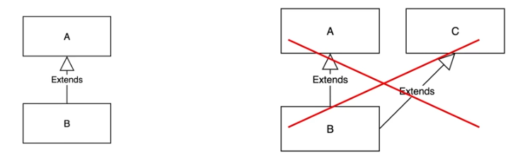
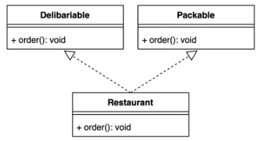

## 📖 추상 클래스보다는 인터페이스를 우선하라

### 핵심 내용

- 일반적으로 다중 구현용 타입으로는 인터페이스가 가장 적합하다.

- 복잡한 인터페이스라면 구현하는 수고를 덜어주는 골격 구현을 함께 제공하는 방법을 고려하자

- 골격 구현은 '가능한 한' 인터페이스의 디폴트 메서드로 제공하여 그 인터페이스를 구현한 모든 곳에서 활용하도록 하는 것이 좋다.

- '가능한 한'이라고 한 이유는, 인터페이스에 걸려 있는 구현상의 제약 때문에 골격 구현을 추상 클래스로 제공하는 경우가 더 흔하기 때문이다.

## 💡 주요 내용 정리 & 🛠️ 실습 코드

- 자바가 제공하는 다중 구현 메커니짐은 인터페이스와 추상 클래스 두가지 이다.

- 자바 8부터 인터페이스도 디폴트 메서드 (default method)를 제공할 수 있게 되어, 이제는 두 메커니즘 모두 인스턴스 메서드를 구현 형태로 제공할 수 있다.

- 한편, 둘의 가장 큰 차리는 추상 클래스가 정의한 타입을 구현하는 클래스는 반드시 추상 클래스의 하위 클래스가 되어야 한다는 점이다.

- 자바는 단일 상속만 지원하니, 추상 클래스 방식은 새로운 타입을 정의하는 데 커다한 제약을 안게 되는 셈입니다.

- 반면 인터페이스가 선언한 메서드를 모두 정의하고 그 일반 규약을 잘 지킨 클래스라면 다른 어떤 클래스를 상속했든 같은 타입으로 취급됩니다.


### 기존 클래스에도 손쉽게 새로운 인터페이스를 구현해넣을 수 있다.

- 인터페이스는 인터페이스가 요구하는 메서드를 추가하고 클래스 선언에 implements 구문만 추가하면 끝입니다.

- 자바 플랫폼에서도 Comparable, Iterable, AutoCloseable 인터페이스가 새로 추가됐을 때 표준 라이브러리의 수많은 기존 클래스가 이 인터페이스들을 구현한 채 릴리스 됐다.


### 인터페이스는 믹스인(mixin) 정의에 안성맞춤이다.

- **예를 들어 Comparable 은 자신을 구현한 클래스의 인스턴스들끼리는 순서를 정할 수 있다고 선언하는 믹스인 인터페이스이다.**

- **이처럼 대상 타입의 주된 기능에 선택적 기능을 '혼합(mixed in)'한다고 해서 믹스인이라고 부른다.**

- 추상 클래스는 믹스인을 정의할 수 없다.

- 이유는 클래스는 두 부모를 섬길 수 없고, 클래스 계층구조에는 믹스인을 삽입하기에 합리적인 위치가 없기 때문이다.


### 인터페이스로는 계층구조가 없는 타입 프레임워크를 만들 수 있다.

- 거대한 클래스 계층구조에는 공통 기능을 정의해놓은 타입이 없으니, 자칫 매개변수 타입만 다른 매서드들을 수없이 많이 가진 커대한 클래스를 낳읗 수 있다.


### 래퍼 클래스 관용구와 함께 사용하면 인터페이스는 기능을 향상시키는 안전하고 강력한 수단이 된다.

예제 : 로깅 기능을 추가한 리스트

1. 기본 인터페이스 정의
```java
import java.util.Collection;

public interface MyList<E> {
    void add(E element);
    void remove(E element);
    Collection<E> getAll();
}
```

2. 기본 구현 클래스
```java
import java.util.ArrayList;
import java.util.Collection;

public class SimpleList<E> implements MyList<E> {
    private final Collection<E> list = new ArrayList<>();

    @Override
    public void add(E element) {
        list.add(element);
    }

    @Override
    public void remove(E element) {
        list.remove(element);
    }

    @Override
    public Collection<E> getAll() {
        return list;
    }
}
```

3. 래퍼 클래스 (데코레이터)
```java
import java.util.Collection;

public class LoggingList<E> implements MyList<E> {
    private final MyList<E> wrapped;

    public LoggingList(MyList<E> wrapped) {
        this.wrapped = wrapped;
    }

    @Override
    public void add(E element) {
        System.out.println("Adding element: " + element);
        wrapped.add(element);
    }

    @Override
    public void remove(E element) {
        System.out.println("Removing element: " + element);
        wrapped.remove(element);
    }

    @Override
    public Collection<E> getAll() {
        return wrapped.getAll();
    }
}
```

4. 사용 예시
```java
public class Main {
    public static void main(String[] args) {
        MyList<String> list = new SimpleList<>();
        MyList<String> loggingList = new LoggingList<>(list);

        loggingList.add("Apple");
        loggingList.add("Banana");
        loggingList.remove("Apple");

        System.out.println("Final list: " + loggingList.getAll());
    }
}
```

5. 출력 결과
```text
Adding element: Apple
Adding element: Banana
Removing element: Apple
Final list: [Banana]
```

- 기능 확장 : LoggingList는 SimpleList를 감싸고(logging wrapper), 추가적인 로깅 기능을 제공합니다.
- 안전성 : 원래의 SimpleList 구현을 수정하지 않고도 새로운 기능을 추가할 수 있습니다.
- 유연성 : 다양한 데코레이터를 조합하여 런타임에 객체의 행동을 동적으로 구성할 수 있습니다.

이처럼 래퍼 클래스와 인터페이스를 함께 사용하면, 기존 기능을 손상시키지 않으면서도 객체의 행동을 안전하고 강력하게 확장할 수 있습니다.


### 인터페이스의 메서드 중 구현 방법이 명백한 것이 있다면, 그 구현을 디폴트 메서드로 제공해 일감을 덜어줄 수 잇다.

- 단, 디폴트 메서드를 제공할 때는 상속하려는 사람을 위한 설명을 @implSpec 자바독 태그를 붙여 문서화해야 한다.

- 많은 인터페이스가 equals와 hashCode 같은 Object의 메서드를 정의하고 있지만, 이들은 디폴트 메서드로 제공해서는 안 된다.

- 인터페이스는 필드를 가질 수 없고 public이 아닌 정적 멤버도 가질 수 없다 (단, private는 정적 메서드는 예외)

- 직접 만들지 않은 인터페이스에는 디폴트 메서드를 추가할 수 없다.


### 인터페이스와 추상 골격 구현 (skeletal implementation) 클래스를 함께 제공하는 식으로 인터페이스와 추상 클래스의 장점을 모두 취하는 방법도 있다.

- 인터페이스로는 타입을 정의하고, 필요하면 디폴트 메서드 몇 개도 함께 제공한다.

- 골격 구현 클래스는 나머지 메서드들까지 구현한다.

- 단순히 골격 구현을 확장하는 것만으로 이 인터페이스를 구현하는 데 필요한 일이 대부분 완료된다.

- ex) 템플릿 메서드 패턴

예제 : 데이터 처리 파이프라인

```java
public interface DataProcessor {
    void process(String data);
}
```

2. 추상 골격 구현 클래스
```java
public abstract class AbstractDataProcessor implements DataProcessor {
    @Override
    public final void process(String data) {
        validate(data); // Step 1: 데이터 검증
        String transformedData = transform(data); // Step 2: 데이터 변환
        save(transformedData); // Step 3: 저장
    }

   // 공통 구현: 데이터 검증
   protected void validate(String data) {
        if (data == null || data.isEmpty()) {
           throw new IllegalArgumentException("Data cannot be null or empty");
        }
   }

   // 추상 메서드: 데이터 변환
   protected abstract String transform(String data);

   // 후크 메서드: 저장 (기본 구현 제공)
   protected void save(String data) {
       System.out.println("Saving data: " + data);
   }
}
```

3. 구체 클래스
```java
public class UpperCaseDataProcessor extends AbstractDataProcessor {
    @Override
   protected String transform(String data) {
        // 데이터를 대문자로 변환
        return data.toUpperCase();
    }
}

public class LowerCaseDataProcessor extends AbstractDataProcessor {
   @Override
   protected String transform(String data) {
       // 데이터를 소문자로 변환
      return data.toLowerCase();
   }

   @Override
   protected void save(String data) {
       // 저장 방식을 변경 (예: 콘솔 대신 파일 저장)
      System.out.println("Saving to file: " + data);
   }
}
```

4. 사용 예
```java
public class Main {
   public static void main(String[] args) {
       DataProcessor upperProcessor = new UpperCaseDataProcessor();
      upperProcessor.process("Hello World");
      
      DataProcessor lowerProcessor = new LowerCaseDataProcessor();
      lowerProcessor.process("Hello World");
   }
}
```

5. 출력 결과
```text
Saving data: HELLO WORLD
Saving to file: hello world
```

예제 설명
```text
인터페이스 정의 (DataProcessor)
- process 메서드를 정의하여 데이터 처리의 큰 흐름을 규정.

추상 골격 클래스 (AbstractDataProcessor)
- process 메서드는 템플릿 메서드로, 데이터 검증, 변환, 저장의 공통 흐름을 캡슐화
- validate와 save는 기본 구현을 제공하며, transform은 하위 클래스에 위임.

구체 클래스 (UpperCaseDataProcessor, LowerCaseDataProcessor)
- 데이터 변환 방식(transform)과 저장 방식(save)을 하위 클래스에서 오버라이드하여 확장.

템플릿 메서드 패턴의 장점
- 재사용성 : 데이터 검증과 저장 로직은 상위 클래스에 구현하여 중복 제거.
- 확장성 : 데이터 변환 및 저장 방식을 하위 클래스에서 자요롭게 변경 가능

이처럼 템플릿 메서드 패턴과 추상 골격 구현을 활용하면 인터페이스와 추상 클래스의 장점을 동시에 취할 수 있습니다.
```


- 관례상 인터페이스 이름이 Interface 라면 그 골격 구현 클래스의 이름은 AbstractInterface 로 짓는다.

- ex) AbstractCollection, AbstractSet, AbstractList, AbstractMap

골격 구현을 사용해 완성한 구체 클래스
```java
import java.util.ArrayList;
import java.util.Objects;

static List<Integer> inArrayAsList(int[] a) {
    Objects.requireNonNull(a);

    // 다이아몬드 연산자를 이렇게 사용하는 건 자바 9 부터 가능하다.
    // 더 낮은 버전을 사용한다면 <Integer>로 수정하자.
    return new ArrayList<>() {
        @Override public Integer get(int i) {
            return a[i]; // 오토박싱
        }
        
        @Override public Integer set(int i, Integer val) {
            int oldVal = a[i];
            a[i] = val; // 오토언박싱
            return oldVal; // 오토박싱
        }
        
        @Override public int size() {
            return a.length;
        }
    };
}
```

- 골격 구현 클래스의 아름다움은 추상 클래스처럼 구현을 도화주는 동시에, 추상 클래스로 타입을 정의할 때 따라오는 심각한 제약에서는 자유롭다는 점에 있다.


### 골격 구현 작성 방법

1. 인터페이스를 잘 살펴 다른 메서드들의 구현에 사용되는 기반 메서드를 선정한다. 이 기반 메서드들은 골격 구현에서는 추상 메서드가 될 것이다.
2. 기반 메서스들을 사용해 직접 구현할 수 있는 메서드를 모두 디폴트 메서드로 제공한다.
   - 단, equals와 hashCode 같은 Object의 메서드는 디폴트 메서드로 제공하면 안된다!!
   - 만약 인터페이스의 메서드 모두가 기반 메서드와 디폴트 메서드가 된가면 골격 구현 클래스를 별도로 만들 이유는 없다.
3. 기반 메서드나 디폴트 메서드로 만들지 못한 메서드가 남아 있다면, 이 인터페이스를 구현하는 골격 구현 클래스를 하나 만들어 남은 메서드들을 작성해 넣는다.
   - 골격 구현 클래스에는 필요하면 public이 아닌 필드와 메서드를 추가해도 된다.

```java
import java.util.Map;
import java.util.Map.Entry;

public abstract class AbstractMapEntry<K, V> implements Map.Entry<K, V> {

    // 변경 가능한 엔트리는 이 메서드를 반드시 재정의해야 한다.
    @Override
    public V setValue(V value) {
        throw new UnsupportedOperationException();
    }

    // Map.Entry.equals 의 일반 규약을 구현한다.
    @Override
    public boolean equals(Object o) {
        if (o == this) {
            return true;
        }
        if (!(o instanceof Map.Entry)) {
            return false;
        }
        Map.Entry<?, ?> e = (Map.Entry) o;
        return Object.equals(e.getKey(), getKey())
                && Object.equals(e.getValue(), getValue());
    }
    
    // Map.Entry.hashCode의 일반 규약을 구현한다.
    @Override public int hashCode() {
        return Objects.hashCode(getKey()) ^ Object.hashCode(getValue());
    }
    
    @Override public String toString() {
        return getKey() + "=" + getValue();
    }
}
```

> Map.Entry 인터페이스나 그 하위 인터페이스로는 이 골격 구현을 제공할 수 없다. 디폴트 메서드는 equals, hashCode, toString 같은
> Object 메서드를 재정의할 수 없기 때문이다.


## 추가 강의 내용 정리


Interface 를 정말 잘 이해하고 있다고 생각하는가?
Interface 를 진심으로 공감하고 있는가?


### Extends vs Implements



extends는 하나만 가능!

```java
import java.io.Serializable;

public class Sub extends Super implements Serializable, Cloneable {}

public interface Sub extends Serializable,Cloneable {}
```


### Example. 배달 앱을 상상해보자

```java
public class Restaurant extends Delibary{}
```
- 포장 주문의 필요성이 생김, 하지만 한 class 밖에는 상속이 불가능한걸?
- 하지만 interface로 만들면 되지!

```java
public class Restaurant implements Delivariable, Packale{}
```
- 하지만 나는 실체가 있는 method가 필요했다고.
- 그래서 Java 8에서 default method가 등장!

```java
public interface Packable {
    default void packOrder(){
       System.out.println("포장 주문이 들어왔습니다.");
    }
}
```


### Default Method의 Diamond 문제 주의



각각 Order가 default method 일 때 -> 어떤 것을 오버라이딩 해야할 지 결정하지 못해 컴파일 에러가 발생하게 된다.

만약 Method가 구현이 되어 있지 않다면 -> 구현된 것이 없기 때문에 이 경우는 문제 없음


### Skeletal Implementation (추상 골격 구현)
1. Interface로 뼈대를 만들고
2. Abstract class로 필요한 구현을 모두 마친 후
3. Subclass로 마무리 하는 것

**주의사항**
Object method (equals, toString ...) 는 default 메서드로 제공하면 안된다.


### 정리

- 머리속에서 항상 Interface를 먼저 떠올리자.
- 뼈대를 만들 때에는 default method가 대안이 될 수 있다.


## 🤔 생각 정리

이번 item을 통해서 추상 클래스와 인터페이스의 사용 방법, 쓰임에 대해서 다시 한번 생각해보게 되었다.

추상 클래스도 다형성의 도구로 많은 유연함을 제공하지만 Interface를 제대로 이해하고 사용했을 때에

추상 클래스보다 더 큰 유연성을 제공해 줌을 알게 되었다.

