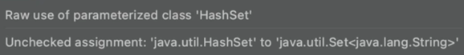

## 📖 비검사 경고를 제거하라

### 핵심 내용

- 비검사 경고는 중요하니 무시하지 말자.

- 모든 비검사 경고는 런타임에 ClassCastException을 일으킬 수 있는 잠재적 가능성을 뜻하니 최선을 다해 제거하라.

- 경고를 없앨 방법을 찾지 못하겠다면, 그 코드가 타입 안전함을 증명하고 가능한 한 범위를 좁혀 @SuppressWarnings("unchecked") 애너체이션으로 경고를 숨겨라.

- 그런 다음 경고를 숨기기로 한 근거를 주석으로 남겨라.


## 💡 주요 내용 정리 & 🛠️ 실습 코드

### 비검사 경고를 제거하라

- 제네릭을 사용하기 시작하면 수많은 컴파일러 경고를 보게 될 것이다.

- 비검사 형변환 경고, 비검사 메서드 호출 경고, 비겸사 매개변수화 가변인수 타입 경고, 비검사 변환 경고 등이다.

- 제네릭에 익숙해질수록 마주치는 경고 수는 줄겠지만 새로 작성한 코드가 한번에 깨끗하게 컴파일디리라 기대하지는 말자.

- 곧바로 해결되지 않는 경고가 나타나도 포지하지 말자! 할 수 있는 한 모든 비검사 경고를 제거하라! 

- 모두 제거한다면 그 코드는 타입 안정성이 보장된다!! 즉, 런타임에 ClassCastException이 발생할 일이 없고, 의도한 대로 잘 동작할 것이다.


### 경고를 제거할 수는 없지만 타입 안전하다고 확신할 수 있다면 @Suppress Warnings("unchecked") 애너테이션을 달아 경고를 숨기자

- 안전하다고 검증된 비검사 경고를 숨기지않고 그대로 구면, 진짜 문제를 알리는 새로운 경고가 나와도 눈치채지 못할 수 있다.

- 제거하지 않은 수많은 거짓 경고 속에 새로운 경고가 파묻힐 것이기 때문이다.


### @SuppressWarnings 애너테이션은 항상 가능한 한 좁은 범위에 적용하자.

- @SuppressWarnings 애너테이션은 개별 지역변수 선언부터 클래스 전체까지 어떤 선언에도 달 수 있다.

- 자칫 심각한 경고를 놓칠 수 있으니 절대로 클래스 전체에 적용해서는 안 된다.

- 한 줄이 넘는 메서드나 생성자에 달린 @SuppressWarnings 애너테이션을 발견하면 지역변수 선언 쪽으로 옮기자.
    - 이를 위해 지역변수를 새로 선언하는 수고를 해야 할 수도 있지만, 그만한 값어치가 있을 것이다.

- 애너테이션은 선언에만 달 수 있기 때문에 return 문에는 @SuppressWarnings를 다는 게 불가능하다.
    - 메서드 전체에 달고 싶겠지만, 범위가 필요 이상으로 넓어지니 자제하자.
    - 그 대신 반환값을 담을 지역변수를 하나 선언하고 그 변수에 애너테이션을 달아주자.

```java
public <T> T[] toArray(T[] a) {
    if (a.length < size) {
        // 생성한 배열과 매개변수로 받은 배열의 타입이 모두 T[]로 같으므로
        // 올바른 형변환이다.
        @SuppressWarnings("unckecked") T[] result = (T[]) Arrays.copyOf(elements, size, a.getClass());
        return result;
    }
    System.arraycopy(elements, 0, a, 0, size);
    if (a.length > size) {
        a[size] = null;
    }
    return a;
}
```

**@SuppressWarnings("unchecked") 애너테이션을 사용할 때면 그 경고를 무시해도 안전한 이유를 항상 주석으로 남겨야 한다.**

- 주석을 남김으로서 다른 사람이 해당 코드를 잘못 수정하여 타입 안전성을 잃는 상황을 줄여준다.


## 추가 강의 내용 정리

### Compiler가 보내는 warning을 제거하라

- Warning이 print 된다는 것은 말 그대로 경고를 보내는 것이다.

- Intellij에서는 다음과 같이 경고를 보내기도 한다.

```java
Set<String> test = new HashSet();
```


- 만약 안전하다고 확인할 수 있으면 @SuppressWarnings("unchecker")를 통해 경고를 숨기자. 

### 정리

**내가 경고를 무시한다면??**

서버의 치명적인 에러를 감지하지 못할 수 있다.

잘못 작성한 코드를 지나칠 수 있다.

내가 만든 많은 warning을 통해, 정작 봐야할 중요한 warning을 볼 수 없다.
(특히 의존성을 추가하여 하는 작업일 경우 많음)

동료가 나의 warning을 통해 괴로워 할 수 있다.


## 🤔 생각 정리

- 경고를 무시하고 지나가면 결국 해당 부채는 다시 돌아온다는 것을 명심하자!

