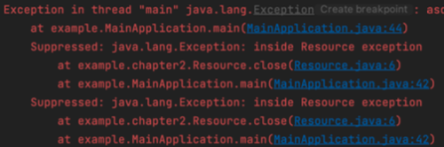

## 아이템 9 - try-finally 대신 try-with-resources

```
static void copy(String src, String dst) throws IOException {
    InputStream in = new FileInputStream(src);
    try {
        OutputStream out = new FileOutputStream(dst);
        try {
            byte[] buf = new byte[100];
            int n;
            while ((n = in.read(buf)) > 0) {
                out.write(buf, 0, n);
            }
        } finally {
            out.close(); // 자원 수동 해제
        }
    } finally {
        in.close(); // 자원 수동 해제
    }
}
```


-   `코드 복잡성 증가`  
    try-finally를 사용할 경우, 자원을 명시적으로 닫아야 하므로 코드가 장황해지고 가독성이 떨어진다.

-   `Stack Trace 어려움`  
    예외가 발생하면 스택 트레이스에서 원인 추적이 어려워질 수 있다.

```
public class Resource implements AutoCloseable {
    
    @Override
    public void close() throws Exception {
        throw new Exception("inside Resource exception");
    }
    
}

try (Resource r1 = new Resource(); 
	 Resource r2 = new Resource()) {
    throw new Exception("Main exception");
}
```



-   `코드 간결화`  
    AutoCloseable을 구현한 객체를 사용하여, 자원을 자동으로 해제한다.

-   `Stack Trace 개선`    
    여러 예외를 다룰 때도 스택 트레이스에서 예외의 원인을 명확히 추적할 수 있다.