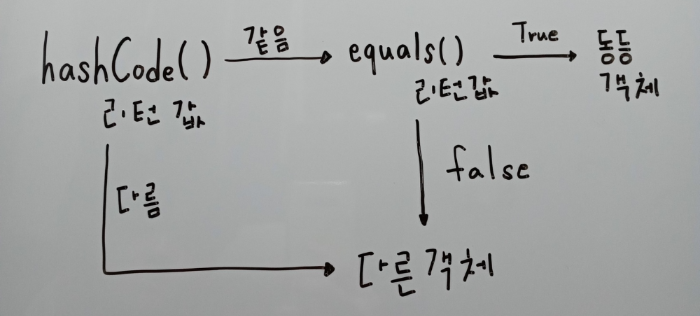

※ 책 내용을 바탕으로 제 관점에서 풀어 쓴 글입니다. 일부 내용이 다를 수 있습니다.

## 아이템 11 - equals를 재정의하려거든 hasecode도 재정의하라

hashCode 메서드는 객체의 주소 값 또는 상태를 기반으로 해시 코드를 생성해 반환한다. 이를 통해 객체를 효율적으로 검색하거나 관리할 수 있다.

하지만 서로 다른 두 객체가 같은 해시코드를 가질 수 있는 경우(해시 충돌)가 있으므로, 해시코드는 객체의 "지문"으로 비유될 수 있다.

---

### 비교 방법의 차이

-   `== 연산자`  
    Primitive 타입은 값을 비교한다.  
    Reference 타입은 메모리 주소를 비교한다.
-   `equals() 메서드`  
    기본값은 ==과 동일하지만, 필요에 따라 Override하여 논리적으로 같은 객체를 정의할 수 있다.
-   `hashCode() 메서드`  
    논리적으로 같은 객체라면 항상 같은 hashCode를 반환해야 한다.  
    이를 재정의하지 않으면 equals와 hashCode의 불일치로 인해 해시 기반 컬렉션(HashMap, HashSet 등)에서 예상치 못한 동작이 발생할 수 있다.

---

### 잘못된 예

```java
// 안내방송을 위한 TTS (text to speak) 예약 Map
Speaker speaker1 = new Speaker("수업 시작 시간입니다.");
Map<Speaker, LocalTime> localTimeMap = new HashMap<>();
localTimeMap.put(speaker1, LocalTime.of(9, 0);

// 수업 시작 시간을 10분 당기기로 하였다.
Speaker speaker2 = new Speaker("수업 시작 시간입니다.");
localTimeMap.put(speaker2, LocalTime.of(8, 50);
```

실제로 안내 방송은 8시 50분과 9시에 두번 울리게 된다.


이와 같은 동작이 발생하는 이유는 Hash 값을 사용하는 컬렉션(HashMap, HashSet, HashTable)이 객체를 논리적으로 비교할 때 다음과 같은 과정을 따르기 때문이다.



-   `hashCode 검증`  
    컬렉션은 먼저 객체의 hashCode를 사용해 해당 객체가 저장된 위치를 찾는다.
-   `equals 검증`  
    동일한 해시코드의 객체가 여러 개 있을 경우, equals 메서드를 사용해 논리적으로 같은 객체인지 추가로 검증한다.

hashCode와 equals 메서드가 일관성 있게 동작하지 않으면 논리적으로 같은 객체라도 다른 객체로 취급되며, 위와 같은 문제가 발생할 수 있다.

---

### 간단한 방식의 hsah

```java
// 가장 Simple하게 적용해야 한다면!
@Override
public int hashCode() {
	int result = message.hashCode();
    return result;
}

// 속도를 고려해야 한다.
@Override
public int hashCode() {
	return Objects.hash(modelName, company); // Objects의 경우 속도가 아쉽다.
}
```

---

### Lombok을 사용한 Equals와 HashCode 구현

```java
@EqualsAndHashCode
public class EqualsAndHashCodeExample {
	private transient int transientVar = 10;
    private String name;
    private double score;
    private String[] tags;
    @EqualsAndHashCode.Exclude private int id;
}
```