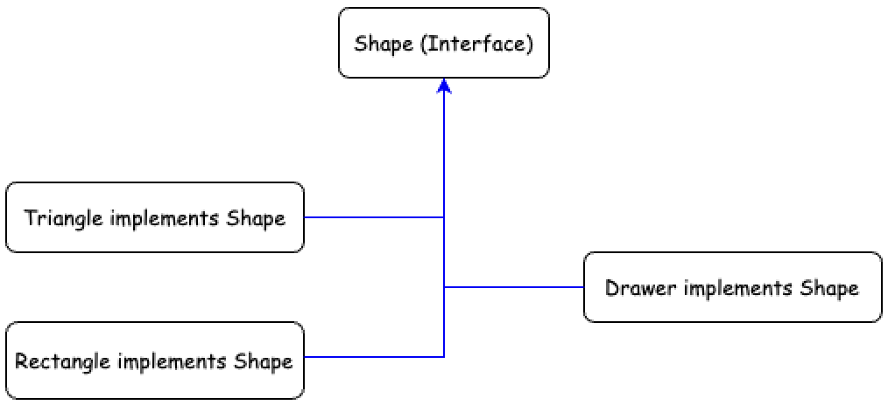

## 아이템 18 - 상속보다는 컴포지션을 사용하라

### 상속의 문제점

-   `캡슐화 파괴`  
    상속은 부모 클래스의 내부 구현 세부 사항을 자식 클래스가 사용할 수 있게 한다.  
    이로 인해 부모 클래스의 내부 구조가 변경되면 자식 클래스에 영향을 미쳐 유지보수가 어려워질 수 있다.
-   `부적절한 동작 가능성`  
    상속된 메서드가 부모 클래스와 자식 클래스 간에 의도와 다르게 작동할 수 있다.  
    부모 클래스가 업데이트되거나 메서드가 추가되면 자식 클래스의 동작이 예기치 않게 변할 가능성이 있다.

`예제 코드`

```java
public class InstrumentedHashSet<E> extends HashSet<E> {
    
    private int cnt = 0;

    @Override
    public boolean add(E e) {
        cnt++;
        return super.add(e);
    }

    @Override
    public boolean addAll(Collection<? extends E> c) {
        cnt += c.size();
        return super.addAll(c);
    }
    
}
```

`설명`

addAll() 메서드는 여러 요소를 추가하기 위해 내부적으로 add() 메서드를 반복 호출한다.

이로 인해 cnt가 실제 추가된 요소 수보다 더 많이 증가하는 문제가 발생한다.

상속으로 인해 부모 클래스의 메서드 호출 방식이 자식 클래스의 의도와 충돌하는 상황을 보여주는 사례이다.

---

### 상속을 대체할 컴포지션(Composition) 사용

`컴포지션이란?`

컴포지션은 기존 클래스의 인스턴스를 새로운 클래스의 필드로 포함하여 기능을 재사용하는 방식이다.

이 방법은 직접 상속하지 않고 캡슐화를 유지하면서 기존 클래스의 기능을 활용할 수 있다.

Forwarding 방식을 사용하여, 새로운 클래스에서 기존 클래스의 메서드를 호출함으로써 기능을 위임할 수 있다. 아래는 컴포지션을 활용한 예제 코드이다.

`예제 코드`

```java
public class InstrumentedSet<E> {
    
    private final Set<E> set;
    private int cnt = 0;

    public InstrumentedSet(Set<E> set) {
        this.set = set;
    }

    public boolean add(E e) {
        cnt++;
        return set.add(e);
    }

    public boolean addAll(Collection<? extends E> c) {
        cnt += c.size();
        return set.addAll(c);
    }
    
}
```

`설명`

HashSet 외에도 TreeSet, LinkedHashSet 등 다른 구현체를 유연하게 포함할 수 있다.

부모 클래스에 직접 의존하지 않으므로 변경에 강건한 설계를 제공한다.

---

### Composite Pattern (합성 패턴)

구조

1.  `Base Component`  
    공통 인터페이스나 추상 클래스를 정의하여 기본 동작을 선언한다.
2.  `Leaf`  
    개별 구성 요소를 나타내는 클래스이며, 실제 작업을 수행한다.
3.  `Composite`  
    복합 객체를 표현하는 클래스이며, 하나 이상의 Base Component를 포함한다.  
    Leaf와 Composite를 동일하게 처리할 수 있도록 기능을 위임하거나 조합한다.

`코드 예제`

```java
interface Shape {
    
    void draw();
    
}

class Triangle implements Shape {
    
    public void draw() {
        System.out.println("Draw Triangle");
    }
    
}

class Rectangle implements Shape {
    
    public void draw() {
        System.out.println("Draw Rectangle");
    }
    
}

class Drawer implements Shape {
    
    private List<Shape> shapes = new ArrayList<>();

    public void addShape(Shape shape) {
        shapes.add(shape);
    }

    public void draw() {
        shapes.forEach(Shape::draw);
    }
    
}
```



`설명`

각 구성 요소(Triangle, Rectangel)는 독립적으로 사용이 가능하다.

복합 객체(Drawer)는 단일 객체처럼 동작하며, 이를 통해 코드의 재사용성과 확장성이 크게 향상된다.

---

### 상속과 컴포지션 비교

| 상속 | 컴포지션 |
| --- | --- |
| 부모 - 자식 간 강한 결합 | 약한 결합 유지 |
| 캡슐화 파괴 가능성 | 캡슐화를 유지 |
| 부모 클래스 변경에 취약 | 부모 클래스 변경에 강건 |
| is - a 관계에서 적합 | has - a 관계에서 적합 |